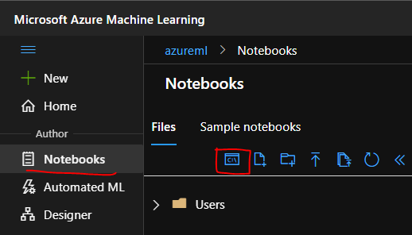
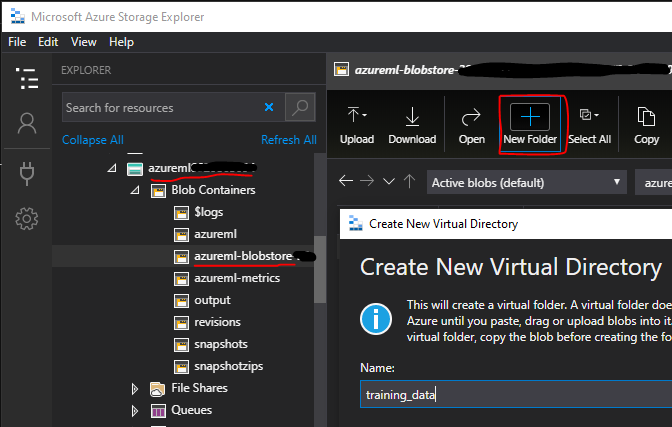
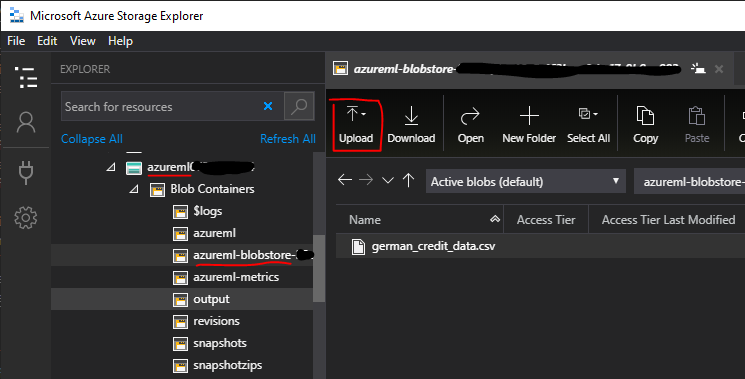

# Reading and Writing Data with Azure Machine Learning

This repo is meant to address the common client question "How can I read and write data from Azure storage?" as part of the data science process using the Azure Machine Learning (AML) platform.

While there different approaches to accomplish this, this repo showcases a simple solution using AML datastores and data references.  

This repo also shows how to parameterize different properties such as the input data path and output data path and utilize the AML CLI to incorporate into an MLOps process.

## Pre-requisites

* AML Workspace: [Create and Manage AML Workspaces](https://docs.microsoft.com/en-us/azure/machine-learning/how-to-manage-workspace?tabs=azure-portal)
* AML Compute Instance: [Create and manage an AML compute instance](https://docs.microsoft.com/en-us/azure/machine-learning/how-to-create-manage-compute-instance?tabs=azure-studio)
* AML Compute Cluster: [Create an AML compute cluster](https://docs.microsoft.com/en-us/azure/machine-learning/how-to-create-attach-compute-cluster?tabs=python)
* Azure Storage Explorer:  [Download](https://azure.microsoft.com/en-us/features/storage-explorer/)

## Steps

1.  Open the [AML Studio](https://ml.azure.com) in a web browser
2.  From the left-hand navigation click `Notebooks`
3.  Click the `Open terminal` icon to open a terminal on the Compute Instance



4.  From the terminal, clone the repo to the remote file share storage for the AML Workspace

    ```
    git clone https://github.com/sqlmartini/aml-read-write.git
    ```
5.  Upload [sample data file](/german_credit_data.csv) to default AML datastore using Azure Storage Explorer in a virtual folder `training_data`
    * First, create a new virtual directory
    * Next, upload the sample data file `german_credit_data.csv`
    * Refer to the screenshots below for details:



    



6.  Review `read-write.py`
    * The `input_data_path` argument is the path to where the input data files are to be read in
    * The `output_data_path` argument is the path to where the output file is to written to
    * The sample csv file is read into a pandas dataframe from the `input_data_path` argument
    * The `output_data_path` directory is created if it doesn't already exist
    * The pandas dataframe is written in csv format to the `output_data_path`

6.  Review `aml_confgi/read-write.runconfig` YAML file
    * Notice the arguments `input_data_path` and `output_data_path` on lines 3 and 4 which match the argument names in `read-write.py`
    * The values passed to the arguments are [AML data references](https://docs.microsoft.com/en-us/python/api/azureml-core/azureml.data.data_reference.datareference?view=azure-ml-py) which represent a path to an AML datastore.  
    * Change the `target` property on line 6 to match the name of your compute cluster
    * The `inputData` data reference is defined on lines 22-26.
    * The `outputData` data reference is defined on lines 28-31.  
    * **Note:** while the `dataStoreName` is the same as the inputData data reference, it could be a different storage account altogether.  You would just need to [register that datastore in AML](https://docs.microsoft.com/en-us/azure/machine-learning/how-to-access-data#create-and-register-datastores)
    * **Note:** data reference names cannot have underscores or dashes

7.  Use the AML CLI to submit an experiment that executes `read-write.py` from the `read-write.runconfig` YAML run configuration
    * From the terminal, navigate to the git repo directory
    ```
    cd aml-read-write
    ```
    * Submit the experiment
    ```
    az ml run submit-script -c read-write -e aml-read-write
    ```
    * `-c` is the name of the run configuration without the extension (.runconfig)
    * `-t` is the name of the AML experiment 

8.  Review and ensure that your experiment completed successfully in AML Studio
    * Click on the `Experiments` tab and review the results of the experiment
    * For troubleshooting, click `Outputs + logs` and review the `70_driver_log.txt` file as needed
    * From Azure Storage Explorer, ensure that the `outputs` virtual folder was created and the sample file was written properly